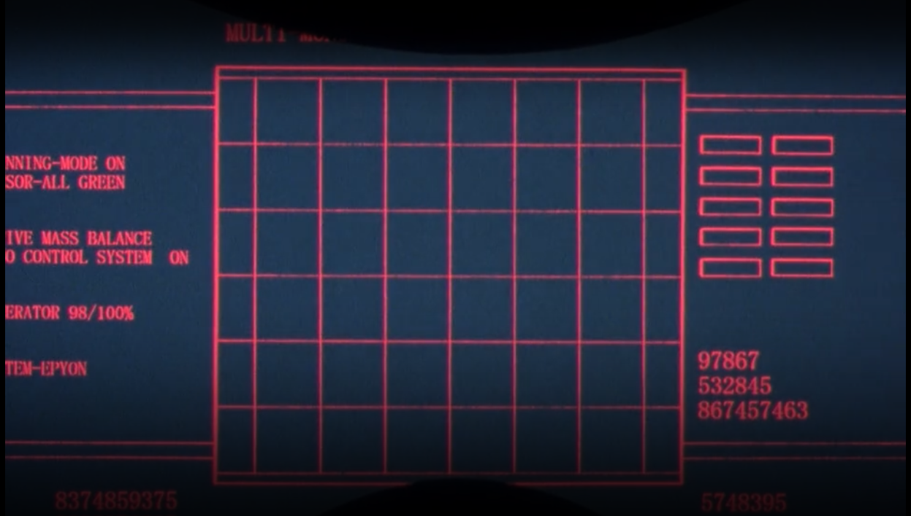

# Epyon System
Treize had a modified version of the deadly ZERO System installed in Epyon's cockpit. Known as the Epyon System, it operated the same as the XXXG-00W0 Wing Gundam Zero's ZERO System, but the pilot wears a special helmet on their head when using the system. Any technical differences compared to the ZERO System is unknown. Zechs also used a modified version of this system to control the White Fang's Mobile Dolls.

In reality, *this* Epyon System aims to be an improvement to the [ZERO System]. In addition to an increased focus on neural networks, the Epyon System utilizes Automatic Differentiation. The ZERO System is an older framework whose differentiation logic is implemented by layer instead of by operation.

[Disclaimer] in ZERO System applies here as well.

[ZERO System]: https://github.com/mrglassdanny/ml-portfolio/blob/main/zero-system/README.md

[Disclaimer]: https://github.com/mrglassdanny/ml-portfolio/blob/main/zero-system/README.md