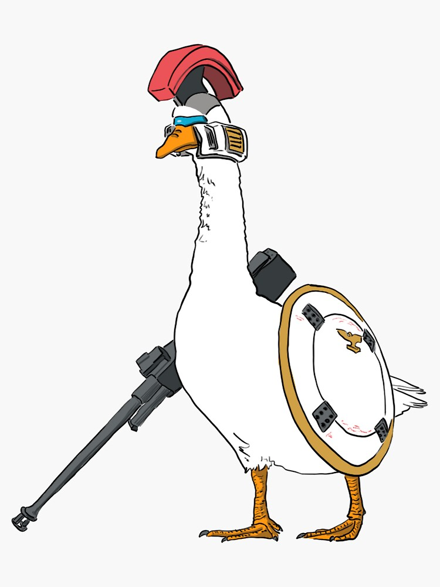

# Tallgeese
Designed by the five scientists, the Tallgeese was the first armed mobile suit, and is the common ancestor of both the Gundams (specifically their prototype, the XXXG-00W0 Wing Gundam Zero) and the mass-produced military mobile suits (most notably the OZ-06MS Leo and its variants). The Tallgeese was a well-rounded unit featuring both long-range and melee weapons, and also has heavy armor coupled with high power "Super Vernier" boosters.

In reality, *this* Tallgeese is a machine learning prototyping project. This is not unlike the [ZERO System], but with a few notable differences:

### CUDA

It is difficult to build machine learning systems with CUDA. Tallgeese will only support execution on the CPU in an attempt to keep things simple and to allow for more rapid prototyping.
    
### Automatic Differentiation

Tallgeese will also be built on top of automatic differentiation. I think that automatic differentiation will be *slower* than what the ZERO System uses, but it will allow for much more flexibility and will make it easier to build new models.

[Disclaimer] in ZERO System applies here as well.

[ZERO System]: https://github.com/mrglassdanny/ml-portfolio/blob/main/zero-system/README.md

[Disclaimer]: https://github.com/mrglassdanny/ml-portfolio/blob/main/zero-system/README.md